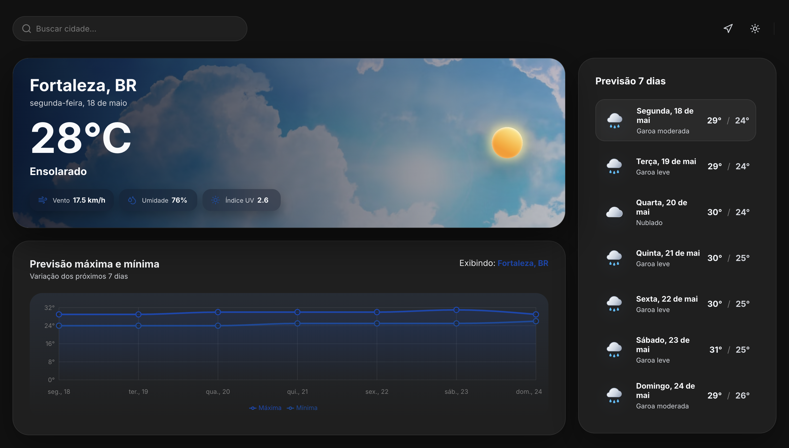
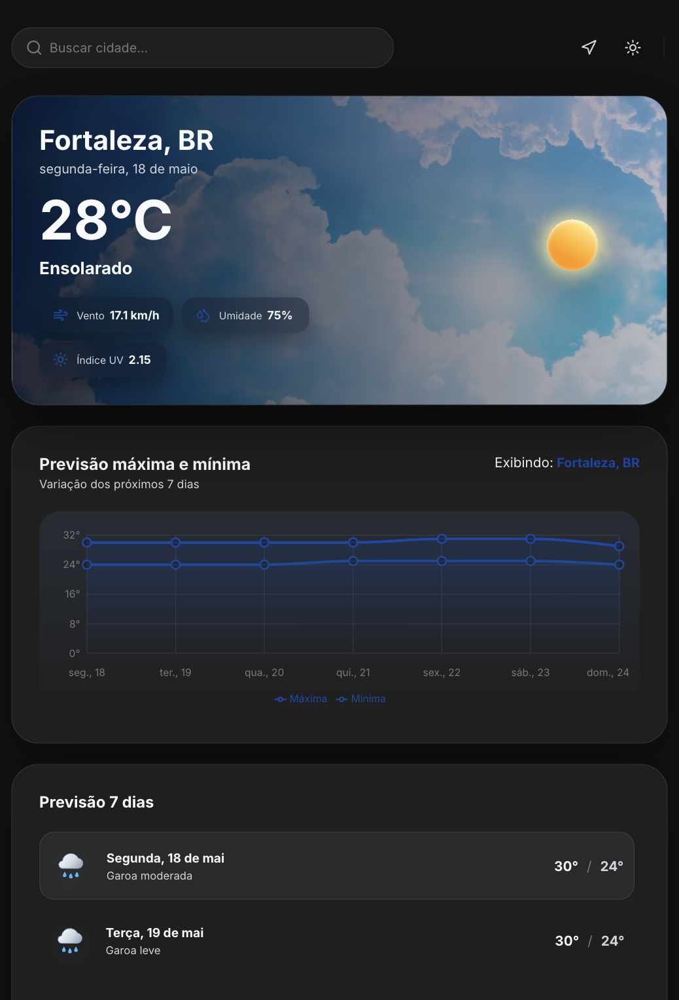
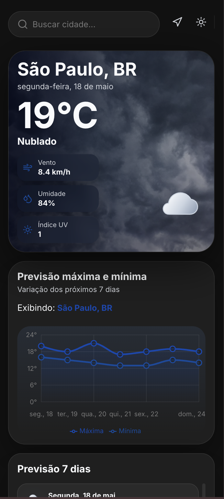

#  Weather 

Aplicacao frontend em React + TypeScript para consulta de clima atual e previsao dos proximos dias. O projeto consome APIs publicas para buscar cidades, detectar a localizacao aproximada do usuario por IP e exibir dados meteorologicos em cards e graficos.

## Funcionalidades

- Pesquisa dinamica por cidade com sugestoes de resultados.
- Geolocalizacao automatica por IP ao abrir a aplicacao.
- Botao para atualizar usando a localizacao atual.
- Exibicao de temperatura atual, umidade, velocidade do vento, indice UV e condicao climatica.
- Previsao dos proximos 7 dias com maxima, minima e imagem da condicao do tempo.
- Grafico de variacao de temperatura minima e maxima usando Recharts.
- Tema claro e escuro com persistencia no `localStorage`.
- Estados de carregamento, erro e tela vazia com mensagens amigaveis.
- Layout responsivo para desktop, tablet e mobile.

## Preview

| Modo claro | Modo escuro |
| --- | --- |
|  |  |

| Tablet | Mobile |
| --- | --- |
|  |  |

## Tecnologias

- React
- TypeScript
- Vite
- Recharts
- Lucide React
- CSS Modules
- Context API

## APIs Utilizadas

- Geolocalizacao por IP: `https://geo.kamero.ai/api/geo`
- Geocodificacao por cidade: `https://geocoding-api.open-meteo.com/v1/search`
- Previsao do tempo: `https://api.open-meteo.com/v1/forecast`

As URLs estao configuradas em `src/config/apiLinks.ts`. Nenhuma chave de API ou variavel de ambiente e necessaria para executar o projeto.

## Como Rodar

1. Clone o repositorio:

```bash
git clone <url-do-repositorio>
cd lapisco-weather
```

2. Instale as dependencias:

```bash
npm install
```

3. Inicie o servidor de desenvolvimento:

```bash
npm run dev
```

4. Abra a URL exibida no terminal, normalmente:

```bash
http://localhost:5173
```

## Scripts Disponiveis

```bash
npm run dev
```

Executa a aplicacao em modo de desenvolvimento.

```bash
npm run build
```

Executa a checagem TypeScript e gera a versao de producao em `dist/`.

```bash
npm run lint
```

Executa o ESLint no projeto.

```bash
npm run preview
```

Serve localmente a build de producao.

## Estrutura Principal

- `src/context/weather`: estado global do clima, cidade selecionada, previsoes e carregamento.
- `src/context/theme`: controle de tema claro/escuro.
- `src/services`: funcoes de acesso as APIs publicas.
- `src/components/layout`: layout geral e cabecalho com busca.
- `src/components/weather`: cards, lista de previsao e grafico.
- `src/utils/weatherCode.ts`: mapeamento dos codigos meteorologicos para descricoes, imagens e fundos.

## Observacoes

- A localizacao automatica e aproximada, pois utiliza geolocalizacao baseada em IP.
- A busca por cidade utiliza a API de geocodificacao da Open-Meteo e seleciona coordenadas para atualizar todos os dados climaticos.
- A aplicacao mantem os dados anteriores visiveis enquanto uma nova busca esta carregando, evitando que os cards desaparecam durante a atualizacao.
